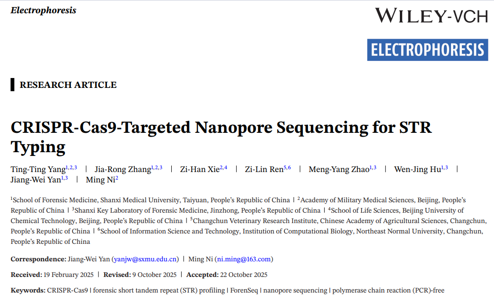
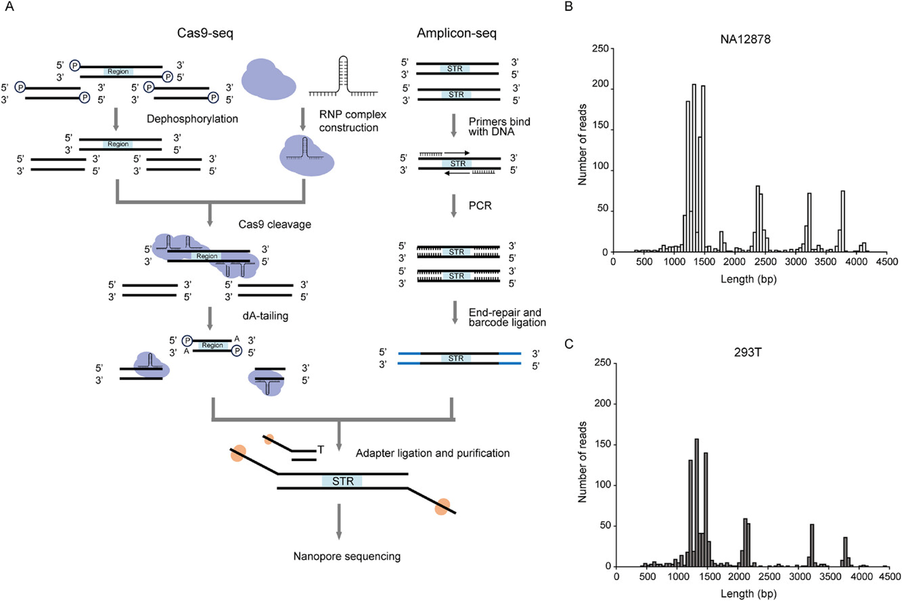
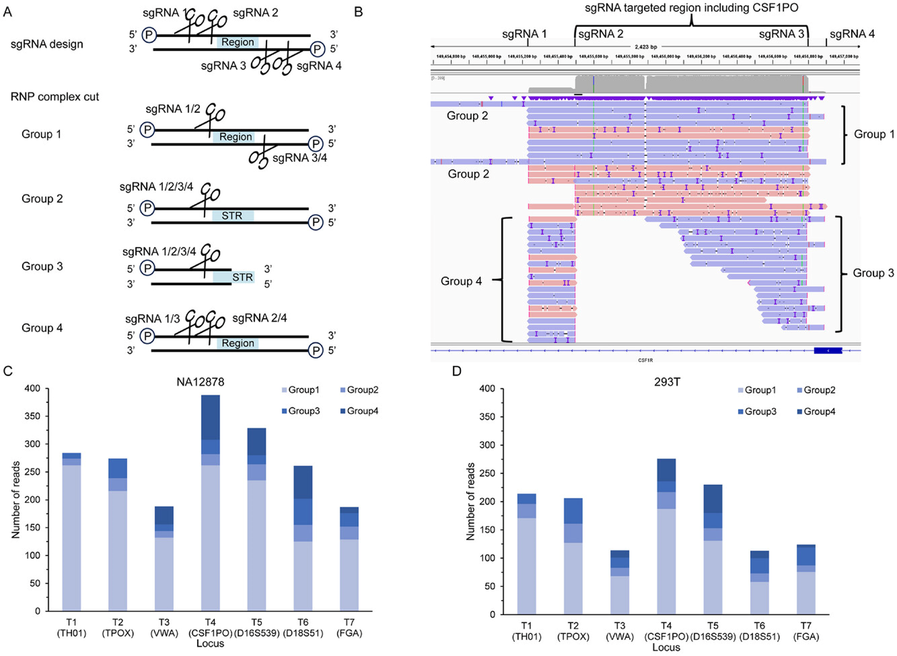
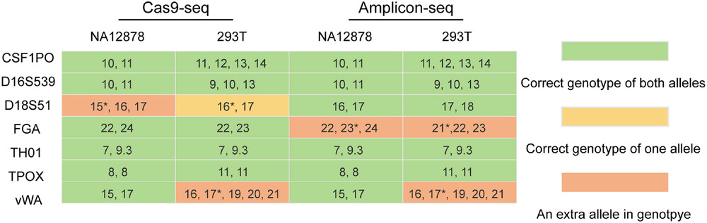

## 

{fig-align="center"}

## **What is STR?** {.smaller}

-   [Short Tandem Repeats]{.underline} (STRs) are genetic markers widely used in human identification and forensic investigations;

-   Selected for high population polymorphism, low mutation rate, and robust amplification;

 

[{fig-align="center" width="672"}](https://ars.els-cdn.com/content/image/3-s2.0-B978012804124600001X-f01-17-9780128041246.jpg)

## **Limitations of conventional PCR**

-   Generation of stutters (amplification artifacts);

-   Failure in long fragments (\>5 kbp) and regions with high GC content;

-   Multiple PCR steps introduce bias and errors.

## Why avoid PCR for STR enrichment?

-   PCR amplification of forensic STRs causes *stutter* artifacts that affect genotyping accuracy and sensitivity;
-   Investigating a PCR-free alternative is therefore scientifically motivated;

. . .

-   ***CRISPR-Cas9 as an enrichment tool;***

. . .

-   Fragments are sequenced by MPS or nanopore --- [**no amplification needed**]{.underline};

## What is nanopore sequencing?

-   A [**single-molecule**]{.underline} sequencing technology --- reads individual DNA strands directly;

-   No amplification required at the sequencing step;

-   Capable of long reads, preserving native DNA modifications (e.g., methylation);

## Nanopore + forensic STRs

-   Several studies have shown nanopore can profile forensic STRs --- but still relying on PCR amplification beforehand;

-   Giesselmann et al. (2019) demonstrated this combination for **long pathogenic STRs** (\>2,599 bp) and CpG methylation detection --- without PCR;

-   But forensic STR profiling demands **high precision**, and no study had yet applied this approach to forensic loci;

. . .

> **This study fills that gap** --- first to combine CRISPR-Cas9 enrichment with nanopore sequencing specifically for forensic STR typing.

## Objective

> Evaluate whether CRISPR-Cas9-guided nanopore sequencing (Cas9-seq), a [PCR-free]{.underline} workflow, is feasible for forensic STR typing---and compare it to amplicon sequencing (amplicon-seq) based on the ForenSeq kit.

## How Does Cas9-seq Work?

**PCR-free workflow:**

1\. Dephosphorylation of genomic DNA;

2\. RNP complex assembly (sgRNA + Cas9 protein);

3\. Cas9 cleavage at target sites;

4\. dA-tailing of cleaved ends;

5\. Sequencing adapter ligation.

## How Does Cas9-seq Work?

{fig-align="center" width="1300"}

## Experimental Design {.smaller}

| Parameter                | Detail                                            |
|------------------------------------|------------------------------------|
| STR loci evaluated       | 7 (CSF1PO, D16S539, D18S51, FGA, TH01, TPOX, vWA) |
| sgRNAs designed          | 28 (4 per locus)                                  |
| Samples                  | NA12878 and 293T (cell lines)                     |
| DNA input (Cas9-seq)     | 3 µg                                              |
| DNA input (amplicon-seq) | 1 ng                                              |
| Sequencer                | MinION Mk1B --- R9.4.1 flow cell                  |
| Validation               | Capillary electrophoresis (CE) with PowerPlex 21  |

## Enrichment of Target Regions

-   Target regions represent only **0.0005%** of the human genome;
-   Cas9-seq achieved average enrichment of:
    -   **643×** in sample NA12878;
    -   **468×** in sample 293T;
-   Average sequencing depth: 212× (NA12878) and 135× (293T);
-   Outperforms previous similar methods (25× [@iyer2022], 10.7× [@wallace2021], and 7× [@zhao2024]);

## Enrichment of Target Regions

{fig-align="center" width="1300"}

## Strand Balance

-   Cas9-seq showed **far superior** forward/reverse strand balance compared to amplicon-seq:
    -   Cas9-seq: **82.86% ± 13.28%**;
    -   Amplicon-seq: **33.18% ± 8.14%**;
-   Statistically significant difference (one-way ANOVA, **p = 0.000122**);
-   Lower strand bias may improve genotyping reliability;

## Genotyping Accuracy

-   Both methods had **identical accuracy: 78.57%**;
-   Each method produced **3 genotyping errors**:

| Method       | Loci with errors                         |
|--------------|------------------------------------------|
| Cas9-seq     | D18S51 (NA12878 and 293T) and vWA (293T) |
| Amplicon-seq | FGA (both samples) and vWA (293T)        |

-   Errors associated with alleles showing relatively high read frequencies (stutter-like pattern);

## Genotyping Accuracy

{fig-align="center" width="1300"}

## Read Noise

-   Cas9-seq showed **higher noise** at loci containing homopolymers:
    -   **FGA**: complex repeat structure with a 6-mer polyA region;
    -   **D18S51**: \[AGAA\]n structure with 3-mer and 5-mer polyA regions;
-   Nanopore sequencing is inherently error-prone in homopolymer regions;
-   Amplicon-seq produced cleaner reads (fewer indels and substitutions);

## Read Noise

{fig-align="center" width="1300"}

## Read Noise

{fig-align="center" width="1300"}

## False-Positive SNPs

-   **Amplicon-seq introduced 3 false-positive SNPs** (confirmed by Sanger sequencing):
    -   chr5:149455858 --- C→T;
    -   chr11:2192265 --- C→A;
    -   chr12:6093102 --- T→A/T (heterozygous);
-   **Cas9-seq introduced no false-positive SNPs**;
-   Mutations arising during initial PCR amplification are erroneously interpreted as true variants;

## Study Limitations

-   Only **2 samples** tested (cell lines, not real forensic samples);
-   Only **7 loci** out of 20 CODIS core STRs evaluated;
-   **High DNA input required** (minimum 3 µg) --- impractical for many forensic samples (dried blood, degraded saliva);
-   **Methylation analysis** was not performed, despite being one of the method's key promises;

## Conclusion

**Where Cas9-seq performed well:**

-   ✅ High target enrichment (\>500× on average);
-   ✅ Excellent forward/reverse strand balance;
-   ✅ No false-positive SNPs introduced;

**Where Cas9-seq fell short:**

-   ❌ Genotyping accuracy identical to amplicon-seq (78.57%);
-   ❌ Higher read noise in homopolymer-containing regions;
-   ❌ Requires a large DNA input amount;

## Conclusion

> **The PCR-free Cas9-seq approach is not currently recommended for forensic STR genotyping. Promising future directions include methylation detection, microhaplotype analysis, and larger genomic markers.**

## References
